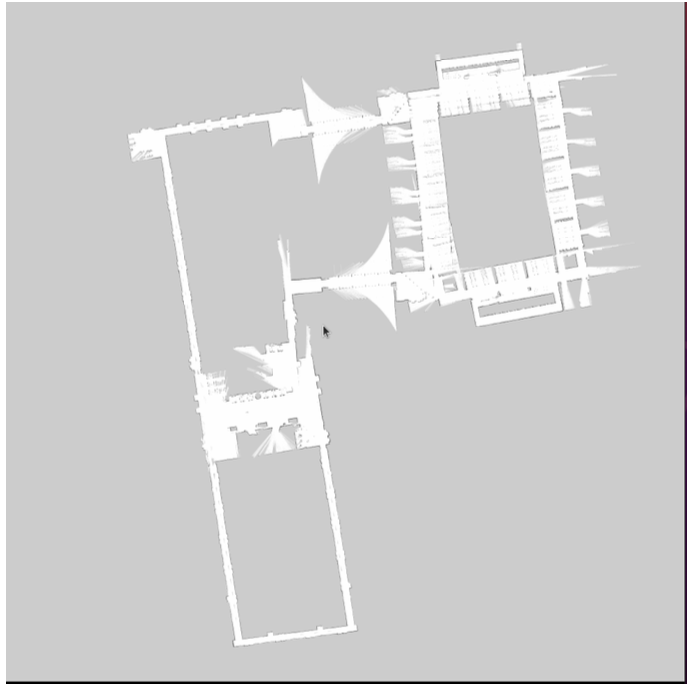
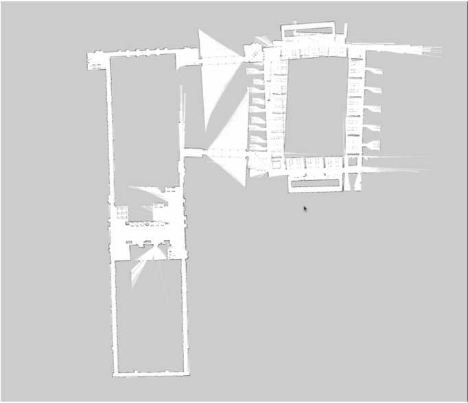

---

# Files Description

### README.md
This file provides an overview of the project, explanation of the methodology, and visualization of the results.

---

### CPE-521 final project.pdf
This report explains:

- The mapping methodology
- Laser scan processing
- Parameter tuning strategy
- Experimental results
- Comparison of mapping performance before and after tuning

---

### CPE-521-Data.zip
This folder contains the **laser scan dataset** used to generate the map.

The data includes:

- Laser scan measurements
- Robot pose information
- Mapping inputs used during the experiment

---

# Results

## Map Before Parameter Tuning

The initial map generated from laser scan data before tuning parameters.

Characteristics:

- Map contains noticeable distortions
- Some structural features are misaligned
- Noise from scan measurements is visible

---

## Map After Parameter Tuning

After adjusting mapping parameters, the map becomes more stable and accurate.

Improvements observed:

- Better alignment of structural boundaries
- Reduced noise in the map
- More consistent representation of the environment
- Improved scan matching results

---

# Parameter Tuning

Mapping parameters were adjusted to improve:

- scan alignment
- noise filtering
- pose estimation accuracy

Proper tuning significantly improves the **quality and stability of the generated map**.

---

# Key Concepts

This project demonstrates several important robotics concepts:

- 2D LiDAR mapping
- Laser scan processing
- Map quality evaluation
- Parameter tuning in robotic perception systems
- Environment reconstruction using sensor data

---

# Applications

Laser scan mapping is widely used in:

- Autonomous robots
- Mobile robot navigation
- Indoor mapping
- SLAM systems
- Autonomous vehicles

---

# Conclusion

The experiment shows that **proper parameter tuning plays a crucial role in Laser-based mapping**.

Without tuning, maps can contain distortions and noise.  
After tuning the parameters, the generated map becomes significantly **clearer, more accurate, and better aligned with the environment structure**.

---

## Tools & Environment

The project was developed and tested using the following environment:

- Ubuntu 20.04
- ROS (Robot Operating System)
- C++
- RViz (visualization)
- LiDAR sensor data
- ROS packages for laser scan processing
---

# Author

Bhagyath Badduri  
Master of Engineering in Robotics  
Stevens Institute of Technology
